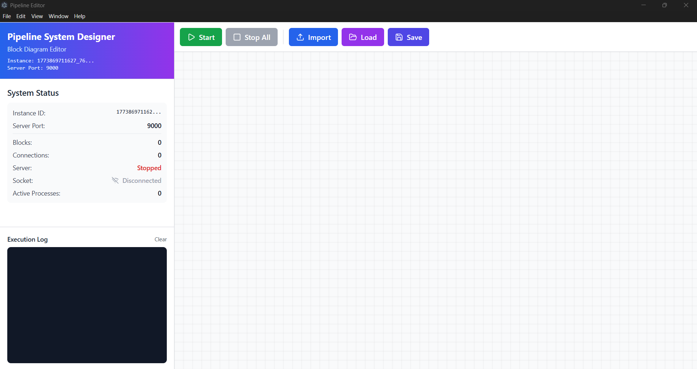
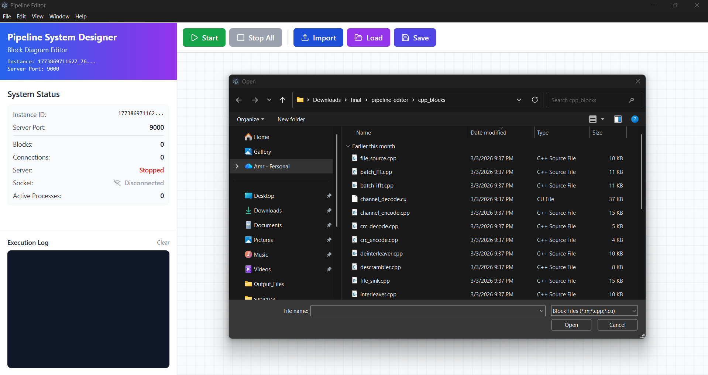
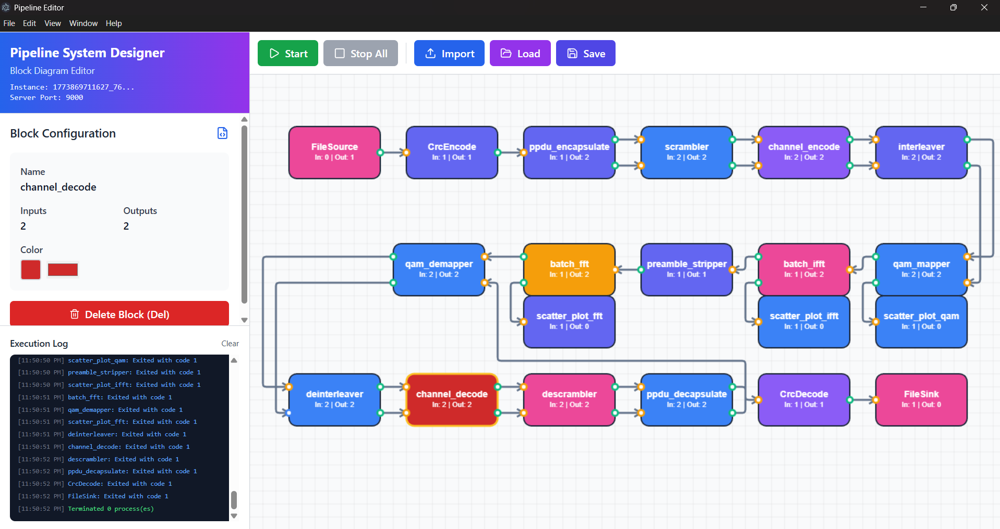
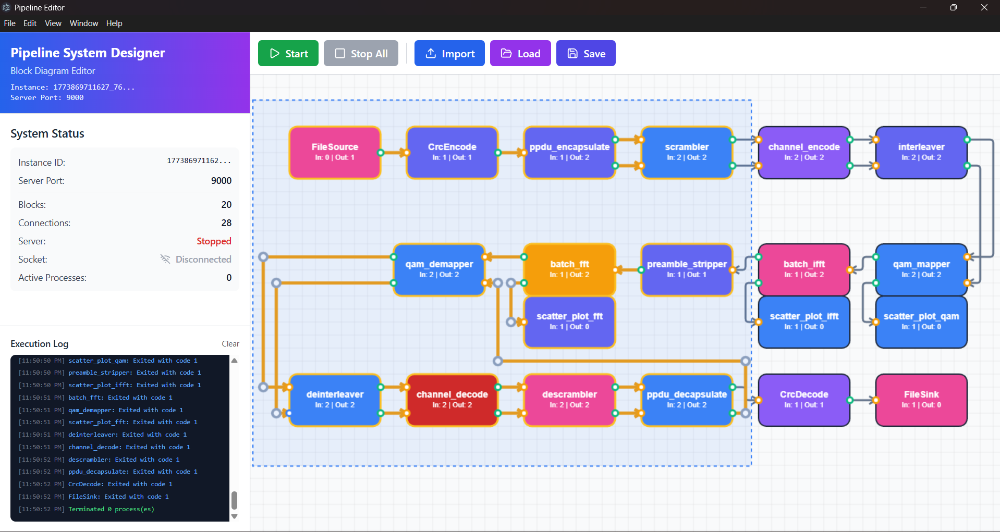

# IEEE 802.11a OFDM Pipeline 📡⚡

A complete end-to-end IEEE 802.11a OFDM transceiver implemented as a visual block diagram pipeline using the Pipeline Editor. The system transmits files over a fully implemented physical layer including CRC, scrambling, convolutional coding, interleaving, QAM mapping, IFFT/FFT, and Viterbi decoding — with GPU acceleration on the decoder side.

[](https://www.youtube.com/embed/415SjxvwzUU?si=JoMYdqp_zO_AFvty)

## 📋 Description

This project implements a complete IEEE 802.11a OFDM transceiver pipeline where every processing stage is an independent C++ block communicating through high-performance shared-memory pipes. Files are read from disk, passed through the full transmitter chain, looped back through the receiver chain, and written back to disk — with an error report generated at the end. The Viterbi channel decoder is GPU-accelerated using CUDA with OpenMP-parallelized depuncturing.

## ✨ Features

- **Full TX/RX Chain**: Complete IEEE 802.11a OFDM transceiver from file source to file sink
- **8 Selectable Data Rates**: 6, 9, 12, 18, 24, 36, 48, and 54 Mbps
- **GPU-Accelerated Viterbi Decoder**: CUDA kernel with one thread block per packet and warp-shuffle best-state reduction
- **CRC-32 Error Detection**: Per-packet error tracking with a final error report
- **Live IQ Scatter Plots**: Constellation diagrams streamed in real-time to the Pipeline Editor UI
- **Batch Processing**: 64-packet batches with async CUDA streams for maximum throughput
- **Visual Pipeline Editor**: Full drag-and-drop block diagram of the entire transceiver

## 🖥️ Screenshots

### Home Screen


### Importing Blocks


### OFDM Pipeline Diagram


### Block Color Customization


### Multi-Block Selection


## 📡 Pipeline Architecture

### Transmitter Chain

```
File Source → CRC Encode → PPDU Encapsulate → Scrambler → Channel Encode
    → Interleaver → QAM Mapper → Batch IFFT → [Channel]
```

### Receiver Chain

```
[Channel] → Preamble Stripper → Batch FFT → QAM Demapper → Deinterleaver
    → Channel Decode → Descrambler → PPDU Decapsulate → CRC Decode → File Sink
```

## 🔬 Block Descriptions

**File Source** reads files from a `Test_Files/` directory and streams them with a framing protocol (start/end flags, filename, file size) through a ring buffer.

**CRC Encode / Decode** appends and verifies a CRC-32 checksum per packet, with the decoder flagging corrupted packets and logging them to an error report.

**PPDU Encapsulate / Decapsulate** builds and parses the IEEE 802.11a PPDU frame, embedding the SIGNAL field (rate + length + parity) and SERVICE field, and computing the exact padded frame bit count passed downstream as `lipBits`.

**Scrambler / Descrambler** XORs the DATA field with a pseudo-random LFSR sequence (generator x⁷ + x⁴ + 1), embedding the seed in the SERVICE field for the receiver.

**Channel Encode / Decode** implements the IEEE 802.11a convolutional encoder (generators g0 = 1011011, g1 = 1111001) with puncturing for rates 2/3 and 3/4. The decoder runs on GPU (CUDA) for DATA and CPU for the short SIGNAL field.

**Interleaver / Deinterleaver** applies the two-step IEEE 802.11a bit interleaver with rate-dependent NCBPS and NBPSC parameters, operating at exact bit granularity.

**QAM Mapper / Demapper** maps coded bits to BPSK, QPSK, 16-QAM, or 64-QAM constellation points, inserts pilot subcarriers, and builds the full 64-subcarrier OFDM symbol. The demapper reverses this process after feedback from the PPDU decapsulator.

**Batch IFFT / FFT** performs 64-point IFFT (TX) and FFT (RX) with cyclic prefix insertion and removal, operating on 64-packet batches.

**Preamble Stripper** removes the 4 preamble symbols (2× STS + 2× LTS) from each time-domain packet in the receiver path.

## 📊 Supported Data Rates

| Rate (Mbps) | Modulation | Coding Rate | N_DBPS |
|-------------|-----------|-------------|--------|
| 6           | BPSK      | 1/2         | 24     |
| 9           | BPSK      | 3/4         | 36     |
| 12          | QPSK      | 1/2         | 48     |
| 18          | QPSK      | 3/4         | 72     |
| 24          | 16-QAM    | 1/2         | 96     |
| 36          | 16-QAM    | 3/4         | 144    |
| 48          | 64-QAM    | 2/3         | 192    |
| 54          | 64-QAM    | 3/4         | 216    |

Rate is configured via `cpp_blocks/bin/rate_config.txt`.

## ⚡ GPU Decoder Optimizations

The Viterbi channel decoder applies several optimizations to maximize throughput on the DATA decode path:

- Async CUDA stream (H2D + kernel + D2H non-blocking)
- OpenMP parallel depuncturing across all packets simultaneously
- Bit-packed survivor memory (1 bit per step — 8× bandwidth reduction)
- Warp-shuffle best-state reduction (replaces serial scan)
- Double-buffered path metrics (1 `__syncthreads()` per step)
- Compact H2D/D2H transfers (~75% less PCIe bandwidth)
- Persistent pinned I/O buffers (no heap alloc per batch)

## 🚀 Getting Started

### Prerequisites

- Windows OS
- Node.js 18+ (Pipeline Editor UI)
- Visual Studio / MSVC with CUDA toolkit (for C++ blocks)
- NVIDIA GPU (for channel decoder)

### Installation

1. **Clone the repository**
```bash
git clone https://github.com/TendoPain18/ieee80211a-ofdm-pipeline.git
cd ieee80211a-ofdm-pipeline
```

2. **Install UI dependencies**
```bash
npm install
```

3. **Compile C++ blocks**

Open the solution in Visual Studio and build all block executables into `cpp_blocks/bin/`.

4. **Set the data rate**

Edit `cpp_blocks/bin/rate_config.txt` and write a single integer (e.g. `9` for 9 Mbps).

5. **Add files to transmit**

Place any files into a `Test_Files/` directory next to the block executables.

6. **Start the Pipeline Editor**
```bash
npm start
```

7. **Load the pipeline and run**

Import the block executables in the Pipeline Editor, connect them as shown in the pipeline diagram, and press Run. Received files are written to `Output_Files/` and an error report is generated at `Output_Files/error_report.txt`.

## 📄 License

This project is licensed under the MIT License - see the [LICENSE](LICENSE) file for details.

## 🙏 Acknowledgments

- IEEE 802.11a standard
- CUDA toolkit and cuFFT documentation
- Pipeline Editor framework

## <!-- CONTACT -->
<!-- END CONTACT -->

## **A complete IEEE 802.11a OFDM transceiver, block by block! 📡✨**
